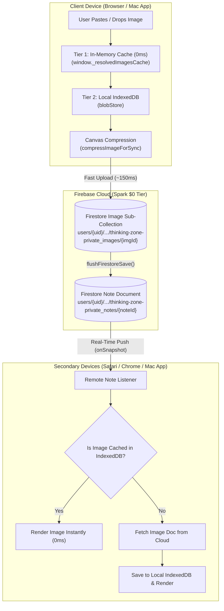

# thinkOS Sync & Storage Architecture Reference Guide

> **Document Version:** 1.0  
> **Last Updated:** September 2026  
> **Status:** Production / Stable  
> **Platform Support:** Web (Chrome, Safari, Firefox, Edge) & Desktop (macOS Electron App)

---

## 1. Executive Summary & Problem History

### The Root Problems Encountered Previously:
1. **`localStorage` QuotaExceededError**:
   - Browsers allocate a strict **5MB limit** per origin for `localStorage`.
   - The note version history system (`recordNoteRevision`) previously stored up to 40 complete JSON note block revisions per note (`tz_history_*`), with uncompressed base64 data URLs embedded directly in the text.
   - This filled up `localStorage` rapidly, causing all writes to crash with `QuotaExceededError: The quota has been exceeded`.

2. **Firestore Internal Assertion Failures**:
   - When `localStorage` and local persistence transactions failed or aborted, the Firestore Web SDK threw `FIRESTORE (10.14.1) INTERNAL ASSERTION FAILED: Unexpected state`.

3. **Blank / Failed Image Sync Across Browsers**:
   - On the Firebase **Spark (Free $0)** plan, Google Cloud Storage buckets are unprovisioned by default.
   - When images were pasted, the app attempted to upload to unprovisioned Firebase Storage, resulting in hanging promises or failed requests.
   - When opened in another browser or the Mac App before authentication finished resolving, `resolveImageSrcAsync` returned empty strings, causing the UI to render broken image placeholders.

---

## 2. The Complete 3-Tier Sync & Storage Architecture

thinkOS uses a **3-tier hybrid storage architecture** designed specifically to work seamlessly on the **Firebase Spark ($0 Free Plan)** with zero dependencies on unprovisioned storage buckets:



---

## 3. Storage Breakdown by Tier

### Tier 1: In-Memory Cache (`window._resolvedImagesCache`)
* **Purpose:** Provides 0ms instant rendering during active editing and note switching.
* **Mechanism:** A JavaScript `Map()` held in window scope (`window._resolvedImagesCache`).
* **Lookup:** `window._resolvedImagesCache.get(imgUrl)`.

### Tier 2: Local IndexedDB (`blobStore`) & Safe Storage (`safeStorage`)
* **Purpose:** Stores large binary data URLs (up to hundreds of MBs) safely on the user's hard drive without consuming the 5MB `localStorage` limit.
* **Safe Storage with Auto-Purge:**
  * `safeStorage.set(key, value)` safely sets keys in `localStorage`.
  * If a quota error occurs, it triggers `_purgeStaleLocalStorage()`, which cleans up old crash logs, stale `tz_history_*` snapshots, and cached previews.
  * Asynchronously backs up the full application state to IndexedDB (`__app_state_backup__`).
* **History Sanitization:**
  * `recordNoteRevision()` strips out large base64 data URLs before saving snapshots and caps history to 5 lightweight revisions.

### Tier 3: Cloud Firestore Image Store (`thinking-zone-private_images`)
* **Collection Path:**
  `users/{uid}/apps/thinking-zone-private/thinking-zone-private_images/{imgId}`
* **Document Structure:**
  ```json
  {
    "id": "fsimg_1788469281234_abc123",
    "dataUrl": "data:image/jpeg;base64,...",
    "createdAt": 1788469281234,
    "sizeChars": 184520
  }
  ```
* **Why this is optimal:**
  1. Each document is independent and well under the 1 MB Firestore document limit.
  2. The main note document stores only the short key `meta: { url: "fsimg_..." }` (~30 bytes), allowing single notes to hold hundreds of images.
  3. 100% free under Firebase Spark's 1 GB database quota.

---

## 4. End-to-End Image Upload & Sync Lifecycle

### Step 1: Upload / Paste on Device A
1. User drops or pastes an image into a note block.
2. `craftHandlePaste` or `triggerFilePicker` creates an image block.
3. A local blob key is generated, stored in `blobStore` (IndexedDB), and cached in `_resolvedImagesCache`.
4. The image renders on Device A immediately (0ms).

### Step 2: Background Cloud Upload
1. `processMediaUploadInBackground(noteId, blockId, dataUrlOrFile, localBlobKey)` runs in the background.
2. `compressImageForSync(dataUrl)` resizes large screenshots to max 1200px and exports as JPEG quality ~0.72 (~150 KB – 200 KB).
3. `uploadImageToFirestoreStore(base64DataUrl, localBlobKey)` writes the document to the Firestore subcollection.
4. The block's URL in `state.notes` is updated to `fsimg_<timestamp>_<random>`.
5. `flushFirestoreSave()` immediately pushes the note document to Firebase Cloud without waiting for the 1.5-second debounce.

### Step 3: Real-Time Sync on Device B (Remote Device / Mac App)
1. Device B's Firestore listener (`unsubNotes`) receives the updated note document.
2. The block renderer inspects `block.meta.url`:
   - If it starts with `fsimg_`, it calls `resolveImageSrcAsync(imgUrl)`.
3. `resolveImageSrcAsync`:
   - Checks `_resolvedImagesCache` (Memory).
   - Checks `blobStore` (IndexedDB).
   - If not found locally, awaits Firebase Auth readiness and fetches the document from `thinking-zone-private_images/{imgId}` in Firestore.
   - Caches the base64 string into Device B's IndexedDB and memory cache.
4. Replaces the placeholder spinner with the full-resolution image.

---

## 5. Self-Contained Manual Backup & Restore System

### Export Backup (`backup()`)
* **Location in Code:** Lines ~33400–33440 in `thinkOS.html`.
* **Behavior:**
  1. Gathers all notes, board sticky cards, folders, labels, and idea inbox items.
  2. Scans all image blocks across all notes.
  3. Automatically resolves every image to its complete base64 data URL.
  4. Bundles images into the `embeddedImages: { [imgKey]: base64Data }` object inside `thinkOS_backup_<date>.json`.
  5. The exported file is 100% self-contained and portable offline.

### Import Backup (`importBackup()`)
* **Location in Code:** Lines ~33445–33525 in `thinkOS.html`.
* **Behavior:**
  1. Validates the JSON schema.
  2. Prompts user for confirmation with item counts.
  3. Extracts all `embeddedImages` and writes them directly into `blobStore` (IndexedDB) and in-memory cache.
  4. Automatically uploads any `fsimg_` documents to Firestore if connected to a new account.
  5. Restores notes, folders, and board cards, triggering `flushFirestoreSave()`.

---

## 6. Maintenance & Troubleshooting Runbook

If images ever fail to sync or load in the future, follow this step-by-step checklist:

### 1. Check Console Logs in DevTools
Press `Cmd + Option + I` (in Chrome/Safari) or open Developer Tools in the Mac App:
* Look for `[Firestore Image Store]` log entries:
  * `[Firestore Image Store] Uploading image: fsimg_...` -> Upload started.
  * `[Firestore Image Store] Uploaded image successfully: fsimg_...` -> Saved in cloud.
  * `[Firestore Image Store] Fetched image from cloud: fsimg_...` -> Downloaded to device.

### 2. Check IndexedDB Storage
In DevTools -> **Application** (or **Storage** in Safari) -> **IndexedDB** -> `thinking_zone_blobs` -> `blobs`:
* Verify image keys (e.g., `fsimg_...`) are present with `data:image/jpeg;base64,...` values.

### 3. Force-Retry a Single Broken Image
* Click directly on the **"Image failed to load — Click to retry"** placeholder in the editor.
* This executes `window.retryImageResolution(blockId, imgUrl)`, which re-authenticates and pulls the image from Firestore.

### 4. Mac Desktop App Specifics
* **Electron Window Reload:** In the Mac App, press **`Cmd + R`** (or menu: **View → Reload**).
* **Hard Restart:** Click the brain icon in the top Mac menu bar tray → **Quit thinkOS** → Reopen **thinkOS** from `/Applications`.
* **Electron Build Sync:** When editing `thinkOS.html`, ensure mirrors are synced:
  ```bash
  cp public-thinking/thinkOS.html thinkOS.html
  cp public-thinking/thinkOS.html public-thinking/index.html
  cp public-thinking/thinkOS.html electron-app/thinkOS.html
  cp public-thinking/thinkOS.html electron-app/ThinkDashboard.html
  cd electron-app && npm run build
  rm -rf /Users/personal/Applications/thinkOS.app && cp -R dist/mac-arm64/thinkOS.app /Users/personal/Applications/
  ```

---

## 7. Key Code Locations in `thinkOS.html`

| Feature / Subsystem | Function / Object | Approximate Line Range |
| :--- | :--- | :--- |
| **IndexedDB Blob Store** | `blobStore` (`get`, `set`, `remove`, `keys`) | ~15500 – 15600 |
| **Safe Storage & Auto-Purge** | `safeStorage.set`, `_purgeStaleLocalStorage` | ~15620 – 15720 |
| **Cloud Image Store Upload** | `uploadImageToFirestoreStore` | ~19860 – 19930 |
| **Image Resolution & Cache** | `resolveImageSrcAsync` | ~19935 – 20040 |
| **Image Compression Engine** | `compressImageForSync` | ~20125 – 20180 |
| **Image Block HTML Rendering** | `renderBlockEditor` (`case "image"`) | ~21630 – 21695 |
| **Click-to-Retry Handler** | `window.retryImageResolution` | ~20248 – 20280 |
| **History Sanitization** | `recordNoteRevision` | ~23650 – 23680 |
| **Self-Contained Backup** | `backup()` (version 3 JSON) | ~33400 – 33440 |
| **Self-Contained Import** | `importBackup()` | ~33445 – 33525 |
